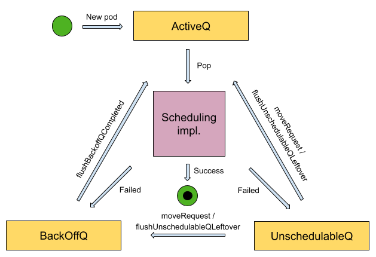

# Scheduling queue in kube-scheduler

Queueing mechanism is an integral part of the scheduler. It allows the scheduler
to pick the most suitable pod for the next scheduling cycle. Given a pod can
specify various conditions that have to be met at the time of scheduling,
such as existence of a persistent volume, compliance with pod anti-affinity rules
or toleration of node taints, the mechanism needs to be able to postpone
the scheduling action until the cluster may meet all the conditions for
the successful scheduling. The mechanism relies on three queues:
- active ([activeQ](https://github.com/kubernetes/kubernetes/blob/4cc1127e9251fff364d5c77e2a9a9c3ad42383ab/pkg/scheduler/internal/queue/scheduling_queue.go#L130)): providing pods for immediate scheduling
- unschedulable ([unschedulableQ](https://github.com/kubernetes/kubernetes/blob/4cc1127e9251fff364d5c77e2a9a9c3ad42383ab/pkg/scheduler/internal/queue/scheduling_queue.go#L135)): for parking pods which are waiting for certain condition(s) to happen
- backoff ([podBackoffQ](https://github.com/kubernetes/kubernetes/blob/4cc1127e9251fff364d5c77e2a9a9c3ad42383ab/pkg/scheduler/internal/queue/scheduling_queue.go#L133)): exponentially postponing pods which failed
  to be scheduled (e.g. volume still getting created) but are expected to get scheduled eventually.

In addition, the scheduling queue mechanism has two periodical flushing goroutines
running in the background responsible for moving pods to the active queue:
- [flushUnschedulableQLeftover](https://github.com/kubernetes/kubernetes/blob/4cc1127e9251fff364d5c77e2a9a9c3ad42383ab/pkg/scheduler/internal/queue/scheduling_queue.go#L350): running every 30 seconds moving pods from unschedulable
  queue to allow unschedulable pods that were not moved by any event
  to be retried again. Pod has to stay for at least 30 seconds in the queue to get moved.
  In the worst case it can take up to 60 seconds to have a pod moved.
- [flushBackoffQCompleted](https://github.com/kubernetes/kubernetes/blob/4cc1127e9251fff364d5c77e2a9a9c3ad42383ab/pkg/scheduler/internal/queue/scheduling_queue.go#L324): running every second moving pods that were backed off
  long enough to the active queue.

Both retry periods for the goroutines are fixed and non-configurable.
Also, in response to certain events, the scheduler
move pods from either queue to the active queue (by invoking [MoveAllToActiveOrBackoffQueue](https://github.com/kubernetes/kubernetes/blob/4cc1127e9251fff364d5c77e2a9a9c3ad42383ab/pkg/scheduler/internal/queue/scheduling_queue.go#L493)).
Example events include a node addition or update, an existing pod being deleted etc.

## Active queue (heap)

A queue with the highest priority pod at the top by default. The ordering
can be customized via QueueSort extension point. Newly created pods, with empty `.spec.nodeName`,
are added to the queue as they come. In each scheduling cycle the scheduler takes
one pod from the queue and tries to schedule it. In case the scheduling algorithm
fails (e.g. plugins error, binding error), the pod is moved to the unschedulable queue.
Or, moved to the backoff queue if a move request was issued at the same or newer time.
The move request signals a move of pods from unschedulable to active, respectively backoff queue.
If a pod is scheduled without an error, it is removed from all queues.

## Backoff queue (heap)
Queue keeping pods in a waiting state to avoid continuous retries. Queue ordering
keeps a pod with the shortest backoff timeout at the top. The more times a pod gets
backed off, the longer it takes for the pod to re-enter the active queue. The backoff
timeout grows exponentially with each failed scheduling attempt until it reaches its maximum.
Scheduler allows to configure initial backoff (set to 1 second by default) and maximum
backoff (set to 10 seconds by default). A pod can get to the backoff queue
when a move request (see below) is issued.

As an example a pod with 3 failed attempts gets the target backoff timeout
set to curTime + 2s^3 (8s). With 5 failed attempts the timeout gets set to curTime +2s^5 (32s).
In case the maximum backoff is too low (e.g. the default 10s), a pod can get to the active
queue too often. So it’s recommended to configure the maximum backoff to fit the workloads
so the pods stay in the backoff queue long enough to avoid flooding the active queue
with pods failing too often to be scheduled.

## Unschedulable queue (map)
Queue keeping all pods that failed to be scheduled and were not subject to a move request.
Pods are kept in the queue until a move request is issued.

## Moving request

Moving request triggers an event responsible for moving pods from
unschedulable queue to either the active or the backoff queue. Different cluster
events can asynchronously trigger a moving request and make unschedulable
pods (that were tried before) schedulable again. The events currently include
changes in pods, nodes, services, PVs, PVCs, storage classes and CSI nodes.

It’s possible that a pod fails to be scheduled while a moving request gets issued.
Due to this event, the pod might now be schedulable and the following mechanism
allows such pod to be retried. Every moving request operation stores the current
scheduling cycle under [moveRequestCycle](https://github.com/kubernetes/kubernetes/blob/4cc1127e9251fff364d5c77e2a9a9c3ad42383ab/pkg/scheduler/internal/queue/scheduling_queue.go#L523) variable. After a pod fails scheduling,
it is regularly put in the unschedulable queue. Unless moveRequestCycle
is the current scheduling cycle, in which case the pod takes a shortcut
and gets moved right under the backoff queue.

**Examples**:
- When a pod is scheduled, some pods in the unschedulable queue with matching
  affinity can be made schedulable. If matching affinity is the only required
  condition for scheduling, issuing a moving request for those pods will allow
  them to get finally scheduled.
- A pod is getting processed by filter plugins which give no nodes left for scheduling.
  Meantime an asynchronous moving request gets issued as a reaction on a new node event.
  Moving the pod under the backoff queue will allow the pod to be moved sooner
  into the active queue and check if the new node is eligible for scheduling.

## Metrics

The scheduling queue populates two metrics:
[pending_pods](https://github.com/kubernetes/kubernetes/blob/4cc1127e9251fff364d5c77e2a9a9c3ad42383ab/pkg/scheduler/metrics/metrics.go#L83-L89) and
[queue_incoming_pods_total](https://github.com/kubernetes/kubernetes/blob/4cc1127e9251fff364d5c77e2a9a9c3ad42383ab/pkg/scheduler/metrics/metrics.go#L141-L147).
All three queues count how many pods are pending in each queue and how many
times a pod was enqueued into each queue. Including which event was responsible
for the enqueueing. The events can include failed scheduling attempts,
pod finishing backoff, node added, service updated, etc. The metrics allow us
to see how many pods are present in each queue. Allowing to see how often pods
are unschedulable, what’s the scheduler throughput, or which events are moving
the pods from one queue to another most often.
